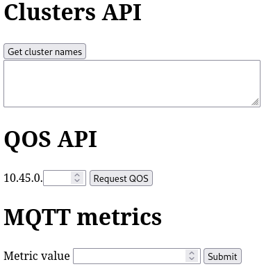

# Example experiment for dutch trial site

This is a simple python FastAPI app that exposes some endpoints that interact
with the various parts of the dutch trial site.

## Contents

### [python_app](./python_app/)

Contains a simple python web application that functions as a GUI to the various
CAMARA APIs that are exposed in the cluster.



This application is purposely left very limited in its features and serves
mainly as an example of how to interact with the CAMARA APIs.

### [application](./application/)

Contains the contents of application archive. Inside is a [helm
chart](./application/Artifacts/MCIOPs/app-example/), as well as the application
metadata required by the EaaS platform.

### [experiment](./experiment/)

Contains the contents of an experiment archive.


## Usage

All the parts of this repository listed above are prepared for use using
[`bundle.sh`](./bundle.sh):

1. Run the script to obtain the packaged application
   ```
   ./bundle.sh
   ```
2. Submit the resulting `app.zip` to the EaaS portal's application page.
3. Now enter the obtained application id to the script. The script will build
   an experiment that references your submitted application.
4. Submit the resulting `experiment.zip` to the the EaaS portal's experiment
   page.
